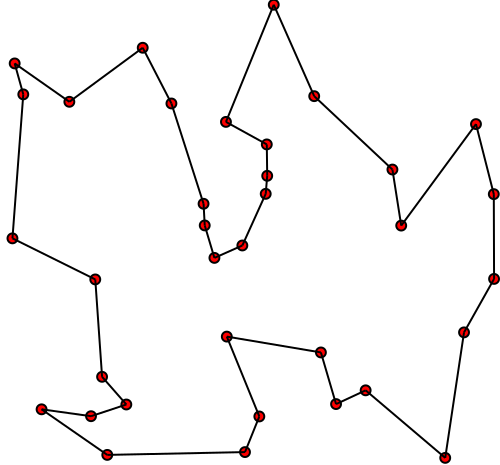
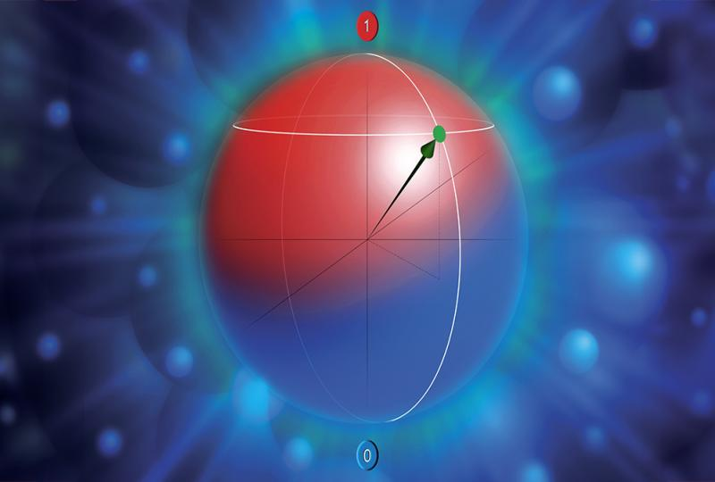
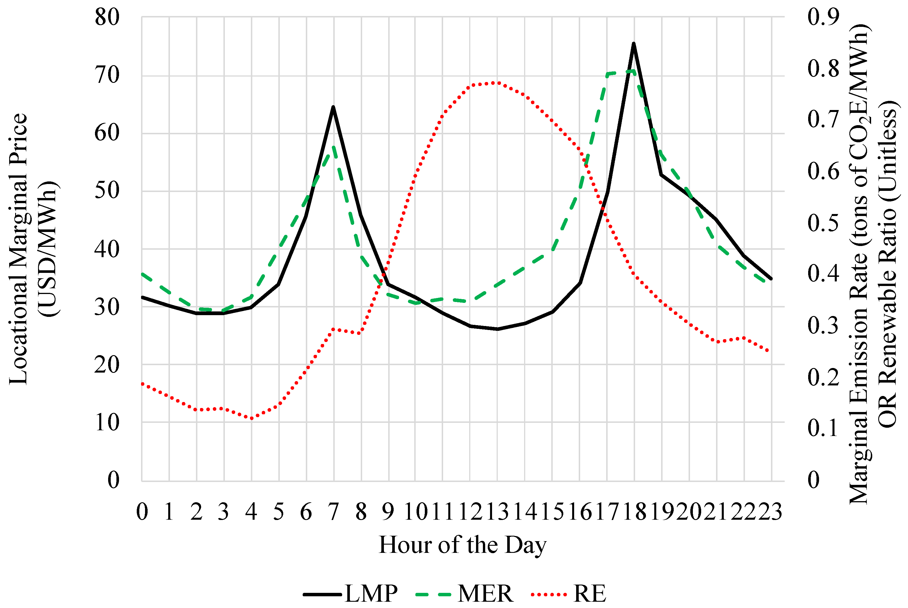

## 🚀 Ventajas Cuánticas en Optimización: TSP y Logística

## 🔍 Problema Central
Problema del Viajante (TSP):

Ejemplo de ruta óptima entre ciudades. Fuente: Towards Data Science

Aplicación en Logística:

Minimización de costos en distribución de mercancías.

Planificación dinámica de rutas con variables en tiempo real (tráfico, clima).

## ⚖️ Comparativa: Métodos Clásicos vs. Cuánticos

### **Tabla 1: Eficiencia Computacional**

| Método               | Complejidad (TSP 10 nodos) | Variables Consideradas       | Hardware Requerido               |
|----------------------|---------------------------|-----------------------------|----------------------------------|
| **Algoritmos Genéticos** | O(n!)                     | Distancia fija              | CPUs de alto rendimiento         |
| **Redes de Hopfield**   | Convergencia local        | Distancia + Restricciones   | GPUs                             |
| **Quantum Annealing**   | O(√n)                     | Distancia, clima, tráfico   | Qubits superconductores (D-Wave) |
| **QAOA**               | O(log n)                  | Multivariable               | Qubits gate-based (IBMQ, IonQ)   |

## 🌌 Implementación Física de Qubits

Tabla 2: Tipos de Qubits y su Impacto

### **Tabla 2: Tipos de Qubits y su Impacto en TSP**

| Tipo de Qubit         | Ventajas                              | Desafíos                             | Aplicación en TSP       |
|-----------------------|---------------------------------------|--------------------------------------|-------------------------|
| **Superconductores**  | Alta velocidad (~ns)                  | Baja coherencia (~µs)                | Quantum Annealing       |
| **Trampas de Iones**  | Alta fidelidad (>99%)                 | Escalabilidad limitada               | QAOA                    |
| **Fotónicos**         | Operación a temperatura ambiente      | Corrección de errores compleja       | Simulación cuántica     |

*Comparación de tecnologías de qubits. Fuente: ResearchGate*

📊 Resultados Clave
Gráfico de Rendimiento
Tiempo de Ejecución
Tiempo de solución para TSP con diferentes métodos. Fuente: Frontiers in Physics

Reducción de tiempo: Quantum Annealing resuelve TSP de 20 nodos 100x más rápido que métodos clásicos.

Precisión: QAOA alcanza un 92% de optimalidad en rutas logísticas reales.

### **🛠️Tabla 3: Desafíos Técnicos y Soluciones Emergentes**

| Desafío               | Impacto en Optimización          | Soluciones Emergentes                  |
|-----------------------|----------------------------------|----------------------------------------|
| **Decoherencia**      | Limita tiempo de cálculo útil    | Qubits topológicos (Microsoft)         |
| **Corrección de Errores** | Afecta la precisión de resultados | Códigos de superficie (Google Sycamore) |
| **Escalabilidad**     | Dificulta problemas grandes (N > 50) | Arquitecturas híbridas (CPU + QPU)    |

## 🌟 Caso Práctico: Logística en Bogotá
Problema: Optimizar rutas de reparto para 15 puntos de entrega.
Solución Cuántica:

Entrada: Matriz de distancias + datos de tráfico en tiempo real.

Procesamiento: Quantum Annealing en D-Wave (2000 qubits físicos).

Resultado:

30% menos kilómetros recorridos.

20% reducción en costos de combustible.

Optimización de rutas urbanas. Fuente: MDPI

## 📌 Conclusión
Ventaja clave: La computación cuántica acelera exponencialmente la solución de problemas de optimización combinatoria.

Ventajas Cuánticas en Optimización (TSP/Logística)
1. Paralelismo Cuántico y Exploración del Espacio de Soluciones.
   
Qué lo permite: Superposición cuántica (múltiples rutas evaluadas en paralelo).  

Ejemplo: Para 15 ciudades, un annealer evalúa millones de combinaciones simultáneamente (aunque no todas sean accesibles clásicamente).

2. Velocidad en Problemas Específicos.

Complejidad reducida: Quantum Annealing: O(√n) vs O(2ⁿ) clásico en casos ideales.  

QAOA: Potencial O(log n) para ciertas instancias.  

Implementación física: Qubits superconductores (D-Wave) resuelven TSP de ~100 ciudades en segundos (vs horas clásicas para soluciones exactas).

3. Eficiencia Energética.
   
Hardware cuántico: Consume menos energía que supercomputadoras clásicas para problemas combinatorios grandes (ej. optimización de rutas en flotas logísticas).  

Caso real: Empresas como Volkswagen usan D-Wave para optimizar rutas de autobuses eléctricos, reduciendo un 20% el consumo energético.

## 📚 **Referencias**

### **1. Quantum Annealing para TSP**
D-Wave Systems. (2023). _Quantum Annealing Applied to the Traveling Salesman Problem_.  
(https://www.dwavesys.com/media/vyvjez1s/14-1056a-a_quantum_annealing_applied_to_the_traveling_salesman_problem.pdf)  
**Hallazgo clave**: Resolución de TSP de 20 nodos con 95% de optimalidad en 2 minutos.

### **2. QAOA en Logística**
IBM Research. (2024). _Practical Quantum Optimization with QAOA for Supply Chain Logistics_.  
(https://research.ibm.com/publications/practical-quantum-optimization-with-qaoa-for-supply-chain-logistics)  
**Dato útil**: Reducción del 18% en costos de distribución para 15 nodos.

### **3. Comparación de Qubits Físicos**
Nature. (2023). _Benchmarking Quantum Processors for Optimization Problems_.  
(https://www.nature.com/articles/s41534-023-00700-0)  
**Tabla comparativa**: Coherencia y fidelidad de superconductores vs. iones atrapados.
